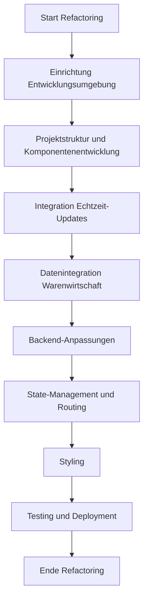

# Refactoring-Plan für das Frontend mit React und Vite

## Ziel
Modernisierung des Frontends der FD_SCREEN-Anwendung durch Umstellung auf React mit Vite, um die Wartbarkeit, Performance und Skalierbarkeit zu verbessern, während Echtzeit-Updates und die Integration mit der Warenwirtschaftsdatenbank (SQL Anywhere und MySQL) erhalten bleiben. Das bestehende PHP-Backend mit WebSocket-Integration (`srv_websocket.php`) wird beibehalten.

## Projektstruktur
Die neue Projektstruktur wird wie folgt organisiert sein, um eine klare Trennung zwischen Frontend und Backend zu gewährleisten:

- **approot/**
  - **frontend/**: Enthält alle Dateien und Assets, die mit dem neuen Frontend (React und Vite) zu tun haben.
    - **src/**: React-Quellcode, Komponenten, Hooks, Utils.
    - **public/**: Statische Assets wie Bilder, Fonts.
    - **dist/**: Kompilierte Ausgabe von Vite für die Bereitstellung.
  - **backend/**: Enthält alle Dateien, die mit dem Backend zu tun haben.
    - Bestehende PHP-Dateien wie `actions.php`, `srv_websocket.php`, `config.php`, etc.
    - Datenbankzugriffsskripte und andere Backend-Logik.

## Schritte des Refactorings

1. **Einrichtung der Entwicklungsumgebung**
   - **Ziel**: Eine moderne Entwicklungsumgebung mit Vite und React einrichten.
   - **Schritte**:
     - Installation von Node.js und npm, falls nicht bereits vorhanden.
     - Erstellung eines neuen Vite-Projekts mit React in `approot/frontend` (`npm create vite@latest fd-screen-react --template react`).
     - Konfiguration von Vite für die Entwicklung und den Build-Prozess, einschließlich Proxy-Einstellungen für Backend-Aufrufe während der Entwicklung.

2. **Projektstruktur und Komponentenentwicklung**
   - **Ziel**: Die bestehende UI-Struktur in React-Komponenten umwandeln.
   - **Schritte**:
     - Erstellung einer grundlegenden Projektstruktur in `approot/frontend/src` mit Ordnern für Komponenten, Seiten, Hooks und Utils.
     - Umwandlung der bestehenden HTML-Struktur (z.B. aus `index.php`) in React-Komponenten wie `App`, `Dashboard`, `OrderColumn`, `OrderItem`.
     - Implementierung von Drag-and-Drop-Funktionalität mit einer Bibliothek wie `react-beautiful-dnd`, um die bestehende Funktionalität von Dragula zu ersetzen.

3. **Integration von Echtzeit-Updates**
   - **Ziel**: Sicherstellen, dass Echtzeit-Updates über WebSocket weiterhin funktionieren.
   - **Schritte**:
     - Implementierung eines WebSocket-Clients in React, der mit dem bestehenden `srv_websocket.php` kommuniziert.
     - Erstellung von Hooks (z.B. `useWebSocket`) für die Verwaltung von WebSocket-Verbindungen und Updates.
     - Aktualisierung des Redux- oder Context-States bei eingehenden WebSocket-Nachrichten, um die UI in Echtzeit zu aktualisieren.

4. **Datenintegration mit der Warenwirtschaftsdatenbank**
   - **Ziel**: Nahtlose Integration der Daten aus SQL Anywhere und MySQL.
   - **Schritte**:
     - Wiederverwendung der bestehenden AJAX-APIs (z.B. `actions.php`) für Datenabrufe und -updates.
     - Erstellung von API-Wrappern in React (z.B. mit `axios`), um Daten von der Warenwirtschaftsdatenbank zu laden und zu speichern.
     - Anpassung der API-Antwortformate, falls notwendig, um sie mit Reacts State-Management kompatibel zu machen.

5. **Backend-Anpassungen**
   - **Ziel**: Minimale Anpassungen am Backend, um die React-App zu unterstützen.
   - **Schritte**:
     - Anpassung von `index.php`, um eine minimale HTML-Seite zu rendern, die den React-Einstiegspunkt enthält (z.B. `

`).
     - Konfiguration des Servers, um statische Dateien aus dem `approot/frontend/dist`-Ordner von Vite auszuliefern.
     - Überprüfung und ggf. Anpassung der CORS-Header für Entwicklungszwecke, falls Frontend und Backend auf unterschiedlichen Ports laufen.

6. **State-Management und Routing**
   - **Ziel**: Effektive Verwaltung des Anwendungszustands und der Navigation.
   - **Schritte**:
     - Implementierung von Redux oder React Context für das State-Management, insbesondere für Aufträge und Echtzeit-Updates.
     - Verwendung von React Router für die Navigation zwischen verschiedenen Ansichten (z.B. Dashboard, Lagerverwaltung, Kalender).

7. **Styling**
   - **Ziel**: Beibehaltung des bestehenden Designs mit minimalen Änderungen.
   - **Schritte**:
     - Übernahme der bestehenden CSS-Stile aus `css/style.css` in React, möglicherweise mit CSS-Modulen oder Styled Components.
     - Anpassung der Stile, um sicherzustellen, dass sie mit React-Komponenten kompatibel sind.

8. **Testing und Deployment**
   - **Ziel**: Sicherstellen, dass die Anwendung korrekt funktioniert und bereitgestellt werden kann.
   - **Schritte**:
     - Implementierung von Unit-Tests mit Jest und React Testing Library für wichtige Komponenten.
     - Durchführung von Integrationstests, um sicherzustellen, dass Echtzeit-Updates und Datenintegration korrekt funktionieren.
     - Build der React-App mit Vite und Bereitstellung der statischen Dateien auf dem Server in `approot/frontend/dist`.

## Mermaid-Diagramm für den Refactoring-Prozess

## Zusätzliche Überlegungen
- **Echtzeit-Updates**: Die bestehende WebSocket-Integration (`srv_websocket.php`) wird beibehalten und in React über einen WebSocket-Client implementiert, um sicherzustellen, dass Änderungen in der Warenwirtschaftsdatenbank unmittelbar im Frontend sichtbar sind.
- **Datenintegration**: Die Daten aus SQL Anywhere und MySQL werden weiterhin über die bestehenden PHP-APIs abgerufen, wobei React die Daten effizient verarbeitet und anzeigt.